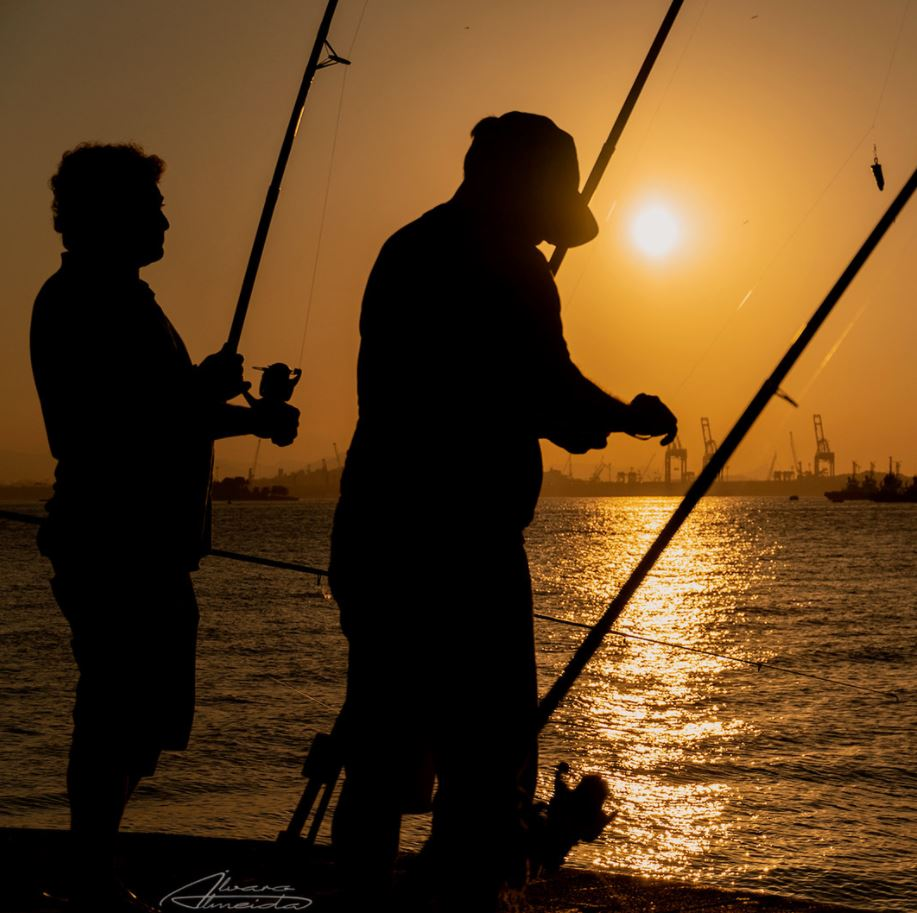

```{r, include=FALSE}
knitr::opts_chunk$set(echo = FALSE, warning=FALSE, error = FALSE, message = FALSE)
```


## R Workshop for the AFSC RACE Groundfish Assesment Group

<div class = "row">
<div class = "col-md-6">

<!-- .](aboutimg.jpg) -->

.](aboutimg.jpg)
<!--  -->

</div>

<div class = "col-md-6">

[Blurb]

</div>


