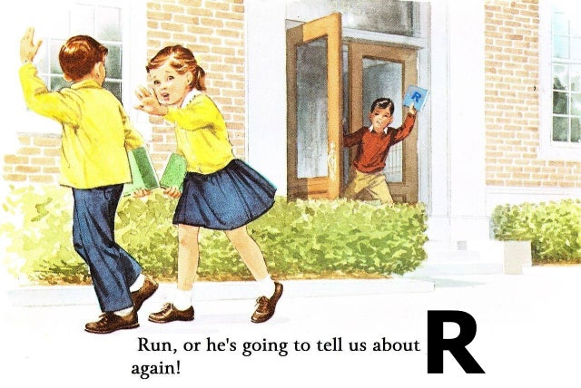

<div class = "row">
<div class = "col-md-6">



</div>
<div class = "col-md-6">


# Don't forget to Install R!

Submit an [IT request](https://sites.google.com/a/noaa.gov/afsc-home/it-services/service-desk) to have the latest version of these softwares installed: 

#### [R](https://cran.r-project.org/bin/windows/base/)

The base graphical user interface (GUI) program, which is needed to run RStudio.

#### [RStudio](https://rstudio.com/products/rstudio/download/)

an integrated development environment (IDE) is a set of tools designed to help you be more productive with R. (There are some weathered souls out there who endeavor to use the R GUI, but we assure you that the RStudio interface is much nicer to work in!)

#### [RTools](https://cran.r-project.org/bin/windows/Rtools/)

Base tools needed for some functions and packages to work in R.

</div>


# Video Tutorials

These videos were created for the R Workshop for NMFS Social Scientists Workshop from September 2020 

*Please click on the title to see the session description*


```{r setup, include=FALSE}
knitr::opts_chunk$set(echo = FALSE, warning=FALSE, error = FALSE, message = FALSE)
library(tidyverse)
library(lubridate)
library(htmltools)
```

```{r}
PreMaterial <- data.frame(read_csv("./R Workshop Video Links.csv", col_names = FALSE))
names(PreMaterial)<-PreMaterial[2,]
PreMaterial<-PreMaterial[-c(1:3),]
PreMaterial<-PreMaterial[!(is.na(PreMaterial$Topic)),]
PreMaterial0 <- PreMaterial

PreMaterial$NeedToKnow<-c(paste0("Importance Level: ",PreMaterial$`Importance Level`[1]), PreMaterial$`Importance Level`[-1])

PreMaterial$Notes<-gsub(pattern = '"', replacement = "'", x = PreMaterial$Notes)
PreMaterial$Notes0<-paste0('tags$li(
                            tags$p("Fun-ness: ', PreMaterial$`Fun-ness`, '"),
                            tags$p("Suggested For: ', PreMaterial$`Suggested for`, '"),',
                            ifelse(is.na(PreMaterial$Notes), "",
                                             paste0('
                                             tags$p("', PreMaterial$Notes, '"),
                                             ')),
                            'tags$a(href="', PreMaterial$`Video Link`, '", "Video Link"),
                            tags$p(""),
                            tags$a(href="', PreMaterial$Playlist, '", "Playlist Link"))')

PreMaterial$Title<-(PreMaterial$Topic)
PreMaterial$Authors<-"Aaron Mamula"
PreMaterial<-data.frame(PreMaterial)
rownames(PreMaterial)<-1:nrow(PreMaterial)
```

```{css}
.schedule {
  display: flex;
  justify-content: space-between;
  flex-wrap: wrap;
}

.limit {
  width: 100%;
  padding: 5px 0 5px 0;
}

.workshops-button {
  padding: 0.75em 1.25em;
  background-color: #cccccc;
  opacity: 0.9;
  width: auto;
  color: black;
  text-align: center;
  overflow: auto;
}

.workshops-button {
  padding: 0.75em 1.25em;
  background-color: #cccccc;
  opacity: 0.9;
  width: auto;
  color: black;
  text-align: center;
  overflow: auto;
}

.left-date {
  width: 20%;
  float: left;
  text-align: left;
}

.center-title {
  width: 60%;
  float: left;
  text-align: left;
  font-size: 120%;
}

.right-authors {
  width: 20%;
  float: right;
  text-align: right;
}

.workshops {
  margin: 1em 1em 0 0;
}

.active {
  background-color: #333333;
  color: whitesmoke;
}

```

```{js}
function main() {
  $('.schedule').hide();
  $('.schedule').fadeIn(2000);
  $('.workshops').hide();
  $('.workshops-button').on('click', function() {
    $(this).next().slideToggle(400);
    $(this).toggleClass('active');
  });
}
 
$(document).ready(main);
```

```{r}
counter<-1
```


### `r unique(PreMaterial$Playlist.Title)[counter] `

```{r}
program1<-PreMaterial[PreMaterial$Playlist.Title %in% unique(PreMaterial$Playlist.Title)[counter],]

div(
  class = "schedule",
  apply(program1, 1, function(event) {
    div(
      class = "limit",
      div(class = "workshops-button", 
          div(class = "left-date", 
              # (eval(parse(text=event[['NeedToKnow']])))),
              event[['NeedToKnow']]),
          div(class = "center-title", 
              # tags$i(event[['Title']])),
              tags$b(event[['Title']])),
          div(class = "right-authors",
              event[['Authors']])),
      tags$ul(class = "workshops",
              (eval(parse(text=event[["Notes0"]])) ) )
              # event[["Notes"]])
    )
  })
)

counter<-counter + 1
```

<br>


### `r unique(PreMaterial$Playlist.Title)[counter] `

```{r}
program1<-PreMaterial[PreMaterial$Playlist.Title %in% unique(PreMaterial$Playlist.Title)[counter],]

div(
  class = "schedule",
  apply(program1, 1, function(event) {
    div(
      class = "limit",
      div(class = "workshops-button", 
          div(class = "left-date", 
              # (eval(parse(text=event[['NeedToKnow']])))),
              event[['NeedToKnow']]),
          div(class = "center-title", 
              # tags$i(event[['Title']])),
              tags$b(event[['Title']])),
          div(class = "right-authors",
              event[['Authors']])),
      tags$ul(class = "workshops",
              (eval(parse(text=event[["Notes0"]])) ) )
              # event[["Notes"]])
    )
  })
)

counter<-counter + 1
```

<br>

